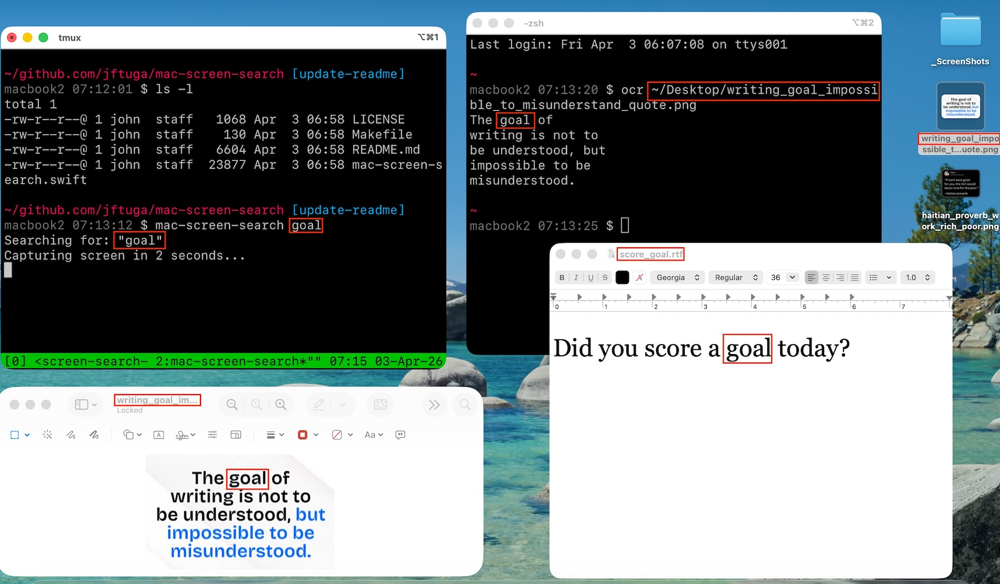
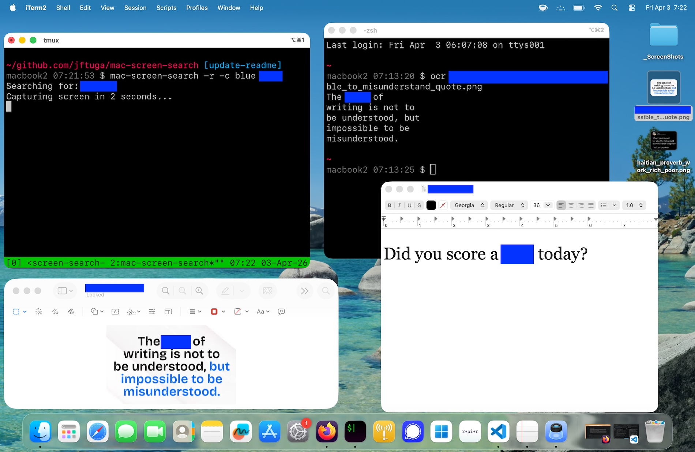

# mac-screen-search


A macOS CLI tool that captures a screenshot of the entire screen, performs OCR to find all instances of a search term, draws colored rectangles around each match, and opens the annotated image in Preview.

It can also process existing image files in batch using a file glob pattern, making it useful for redacting or blurring sensitive text across many screenshots at once.

|  |  |
|:---:|:---:|
| screenshot mode | redact mode |

## AI Disclaimer

This project was vibe-coded with `Claude Opus 4.6`. While it has been tested on the author's system, it interacts directly with macOS screen capture, image processing, and file I/O, the author makes no guarantees and assumes no responsibility for unintended behavior, missed redactions, or any other issues arising from its use. Use at your own risk and always verify redactions before sharing sensitive screenshots.

## Requirements

- macOS (uses ScreenCaptureKit, Vision, and CoreGraphics)
- Screen Recording permission (for screenshot mode)
- Swift compiler (only needed if compiling from source; otherwise install via [Homebrew](#installation) or download a [release](https://github.com/jftuga/mac-screen-search/releases))

## Installation

```sh
brew tap jftuga/tap
brew install jftuga/tap/mac-screen-search
```

To upgrade to a newer version:

```sh
brew update
brew upgrade mac-screen-search
```

### Manual download

Download the macOS arm64 binary from the [releases page](https://github.com/jftuga/mac-screen-search/releases):

```sh
tar -xJf mac-screen-search_v*.tar.xz
cd mac-screen-search_v*/
sudo cp mac-screen-search /usr/local/bin/
```

## Building

```sh
swiftc -o mac-screen-search mac-screen-search.swift
```

## Usage

```
mac-screen-search [-r] [-b <pct>] [-e] [-d <dist>] [-c <color>] [-v]
                  [-n] [-o <path>] [-m <n|all>] [-M] [-l] [-t <secs>] [-w]
                  <search-term> [-f <glob>]
```

### Options

| Flag | Description |
|------|-------------|
| `-r` | Redact (fill with solid color) matched regions instead of outlining them |
| `-b <percent>` | Blur matched regions with Gaussian blur (1-100); mutually exclusive with `-r` |
| `-e` | Enhanced OCR (preprocess image + check multiple candidates) |
| `-d <dist>` | Fuzzy match using Levenshtein distance threshold |
| `-c <color>` | Rectangle color name (default: `red`). Available: black, blue, cyan, gray, green, magenta, orange, pink, purple, red, white, yellow |
| `-f <glob>` | Process image files matching the glob pattern instead of capturing the screen |
| `-n` | Do not open the result in Preview (screenshot mode only) |
| `-o <path>` | Output directory or file path for the screenshot PNG (screenshot mode only) |
| `-m <n\|all>` | Capture monitor `n` (1-based) or `all` monitors (screenshot mode only) |
| `-M` | List connected monitors and exit |
| `-l` | List matches (text and coordinates) without annotating; incompatible with `-r`/`-b` |
| `-t <seconds>` | Capture delay in seconds (default: 2; use 0 for immediate). Screenshot mode only |
| `-w` | Whole-word matching (require word boundaries on both sides of the match) |
| `-h` | Print help and exit |
| `-v` | Print version and exit |

### Screenshot mode (default)

Capture a screenshot, find all occurrences of the search term, outline them in red (default), and open the result in Preview:

```sh
mac-screen-search "password"
```

There is a 2-second delay before capture so you can arrange your screen. Use `-t` to change it:

```sh
mac-screen-search -t 5 "password"    # 5-second delay
mac-screen-search -t 0 "password"    # immediate capture
```

### Custom color

Use blue rectangles instead of red:

```sh
mac-screen-search -c blue "password"
```

### Redact mode

Fill matched regions with a solid color to obscure the text:

```sh
mac-screen-search -r "my_password"
mac-screen-search -r -c black "my_password"
```

### Blur mode

Apply a Gaussian blur to matched regions instead of filling or outlining them. The percentage controls blur intensity (1 = subtle, 100 = fully obscured):

```sh
mac-screen-search -b 50 "my_password"
mac-screen-search -b 80 "api-key" -f '*.png'
```

The `-b` and `-r` flags are mutually exclusive.

### No-open mode

Save the annotated screenshot without opening it in Preview. Useful for scripting and automation:

```sh
mac-screen-search -n "password"
```

### Output path

Control where the screenshot PNG is saved instead of the current working directory:

```sh
mac-screen-search -o ~/Screenshots "password"          # save to directory
mac-screen-search -o ~/Screenshots/result.png "password"  # save to specific file
```

When used with `-m all`, `-o` must point to a directory.

### Monitor selection

Capture a specific monitor by its 1-based index, or all connected monitors:

```sh
mac-screen-search -m 1 "password"      # primary monitor
mac-screen-search -m 2 "password"      # second monitor
mac-screen-search -m all "password"    # all monitors (one file per display)
```

Use `-M` to list connected monitors and their resolutions:

```sh
mac-screen-search -M
```

Example output:

```
Monitor 1: 1512x982  (3024x1964 px) [displayID: 1]
Monitor 2: 2560x1440 (5120x2880 px) [displayID: 2]
```

### List mode

Print match text and pixel coordinates without annotating or saving an image. Output is tab-separated with a header row:

```sh
mac-screen-search -t 0 -l "test"
```

```
Searching for: "test"
Screenshot captured (2940x1912)
Found 3 matches
text    x       y       width   height
test    1766    183     92      42
test    1060    1544    136     35
test    331     1591    143     38
```

In file glob mode, a `file` column is prepended:

```sh
mac-screen-search -l "test" -f '*.png'
```

```
Processing 2 files matching "*.png" for "test"
file    text    x       y       width   height
/Users/john/Screenshots/a.png   test    1089    273     149     34
/Users/john/Screenshots/b.png   test    323     315     151     41
```

The `-l` flag is incompatible with `-r` and `-b`.

### Whole-word matching

Only match when the search term has word boundaries on both sides. Reduces false positives for short search terms:

```sh
mac-screen-search -w "is"    # matches "is" but not "this" or "island"
```

Also works with fuzzy matching (`-d`).

### File glob mode

Process existing image files instead of capturing a screenshot. The glob is expanded by the tool itself (not the shell), so quote the pattern:

```sh
mac-screen-search "secret" -f '*.png'
```

Combine with `-r` or `-b` to batch-redact or blur sensitive text across many files:

```sh
mac-screen-search -r "api-key" -f '~/Screenshots/*.png'
mac-screen-search -b 60 "api-key" -f '~/Screenshots/*.png'
```

In file mode:
- Files are overwritten in-place with the annotated/redacted version
- The original file modification time (mtime) is preserved
- Supported image formats include PNG, JPEG, TIFF, BMP, GIF, and others supported by `CGImageSource`
- A per-file summary is printed; no files are opened in Preview

### Enhanced OCR mode

Use `-e` to improve OCR accuracy on degraded images (e.g., screenshots taken over Zoom, transparent terminal backgrounds):

```sh
mac-screen-search -e "password"
```

- Composites the image onto a white background, removing transparency artifacts that confuse the OCR engine
- Boosts contrast (1.4x) and sharpens edges to make text crisper
- Checks the top 5 OCR candidates per text region instead of only the top 1, catching cases where the correct reading is a lower-ranked alternative

### Fuzzy matching mode

Use `-d <dist>` to match strings within a Levenshtein (edit) distance of the search term. This catches OCR misreads where characters are substituted (e.g., `Z` read as `2`, `g` as `q`):

```sh
mac-screen-search -d 3 "rBZrS6gq7NsD"
```

- Slides a window across each recognized text line and accepts any substring within the given edit distance
- A distance of 1 allows one character substitution, insertion, or deletion; higher values are more permissive
- Short search terms with high distance values may produce false positives; keep the ratio reasonable

### Combining flags

All flags compose freely. For example, to batch-redact a string across many screenshots with enhanced OCR and fuzzy matching:

```sh
mac-screen-search -r -e -d 3 -c black "api-key" -f '~/Screenshots/*.png'
```

Capture immediately, whole-word match, save to a specific directory without opening Preview:

```sh
mac-screen-search -t 0 -n -w -o ~/Screenshots "password"
```

### Example output (file mode)

```
Processing 4 files matching "*.png" for "api-key"
/Users/john/Screenshots/dashboard.png: 2 matches
/Users/john/Screenshots/settings.png: 1 match

2 files updated, 0 errors
```

## How it works

1. **Capture** -- Takes a Retina-resolution screenshot via ScreenCaptureKit (or loads image files in `-f` mode). Supports selecting a specific monitor (`-m`) and configurable delay (`-t`)
2. **OCR** -- Runs Apple Vision's `VNRecognizeTextRequest` with accurate recognition and language correction. With `-e`, the image is preprocessed first and multiple candidates are evaluated
3. **Search** -- Finds all case-insensitive occurrences of the search term, mapping each to pixel-coordinate bounding boxes. With `-d`, uses Levenshtein distance for fuzzy matching. With `-w`, requires word boundaries
4. **Annotate** -- Draws colored outline rectangles (or solid fill with `-r`, or Gaussian blur with `-b`) around each match, using the color specified by `-c` (default: red). Skipped in list mode (`-l`)
5. **Output** -- Saves the result as a timestamped PNG and opens it in Preview (screenshot mode), or overwrites files in-place preserving mtime (file mode). Use `-o` to set the output path and `-n` to skip Preview

## Personal Project Disclosure

This program is my own original idea, conceived and developed entirely:

* On my own personal time, outside of work hours
* For my own personal benefit and use
* On my personally owned equipment
* Without using any employer resources, proprietary information, or trade secrets
* Without any connection to my employer's business, products, or services
* Independent of any duties or responsibilities of my employment

This project does not relate to my employer's actual or demonstrably
anticipated research, development, or business activities. No
confidential or proprietary information from any employer was used
in its creation.
